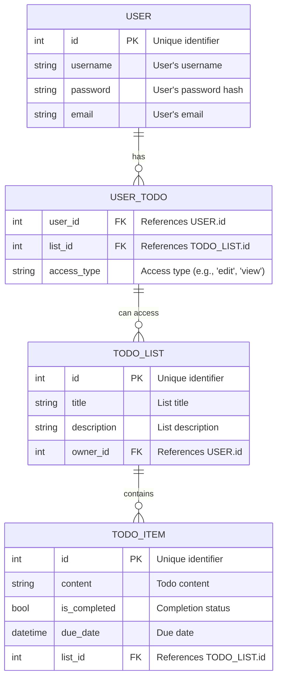

# ✅ To-do List API

Open source backend API implementation for a to-do list application with Express and MySQL.

## Features:

This backend API has some built-in features such as:
- Authentication and authorization
- Collaborative list for multiple users

## Entity Relationship Diagram (ERD):

