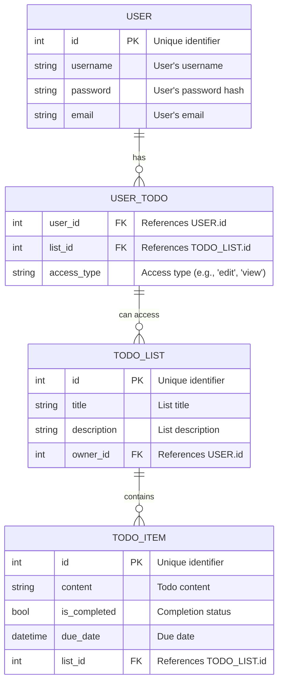

# ✅ To-do List API 

[](https://app.getpostman.com/run-collection/12147807-2387c863-8f9d-4f44-86b7-dd7c72a35d24?action=collection%2Ffork&source=rip_markdown&collection-url=entityId%3D12147807-2387c863-8f9d-4f44-86b7-dd7c72a35d24%26entityType%3Dcollection%26workspaceId%3Df035b87a-c729-40bf-a4b2-0b01c9c7fc62)

Open source backend API implementation for a to-do list application with Express and MySQL.

## Features:

This backend API has some built-in features such as:
- Authentication and authorization
- Collaborative list for multiple users

## Entity Relationship Diagram (ERD):



## Deployment:

To start the server, run:

```bash
docker compose up --build -d
```

Optionally, to seed the database, run:

```bash
docker compose run app npx sequelize db:seed:all
```
